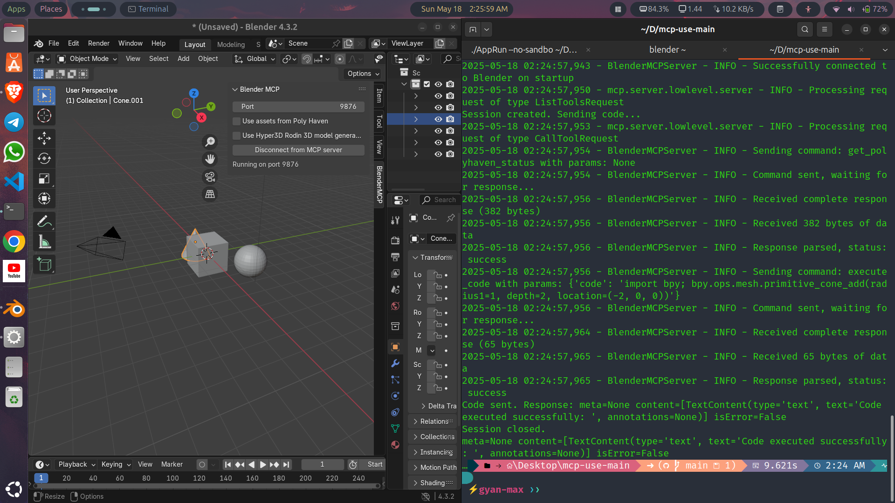

# Prompt-to-3D

### Overview

Prompt-to-3D is an innovative tool designed to make 3D modeling in Blender accessible to everyone, especially beginners and non-technical users. By allowing users to create 3D models using simple text prompts (e.g., "create a red car" or something else), our project eliminates the need to navigate Blender's complex interface. Powered by natural language processing(NLP) and Blender's python API, **Prompt-to-3D** translates plain language into 3D models, empowering anyone to create 3D models with ease.

### Problem Statements

Blender is a powerful 3D modeling tool, but its steep learning curve and intricate interface can be overwhelming for beginners. Many people with great ideas struggle to create 3D models dur to the technical skills required. Prompt-to-3D solves this by enabling users to describe their vision in simple words, making 3D creation intuitive and inclusive.

### Features
- **Natural Language Input:** Create 3D models by typing 
simple prompts like "Create a cube or a circle or anything" 
- **Blender Integration:** Seamlessly works within Blender using its Python API
- **Beginner-Friendly:** No need to learn Blender's tools or workflows.
- **Extensible:** Support future enhancements like advance NLP models or web-based interfaces.

### Tech Stack

- **Blender Python API(byp)**: Automates 3D modeling tasks in Blender.
- **Python**: Core language for scripting and integration
- **NLP/LLM**: Using Ollama and Mistral model for natural language processing
- **Flask**: Lightweight backend for promppt processing
- **HTML/CSS/JavaScript**: For potential web-based interface.

### Installation
**Prerequisites**
- Blender 3.0 or higher
- Python 3.10 or higher
- pip and venv for installing python packages and requirements.

### Steps
## 1. Clone the repository

```bash
git clone https://github.com/yourusername/Prompt-to-3D.git
cd Prompt-to-3D
```
## 2. Set up Virtual Environment
 - for windows
 ```bash
 python -m venv venv
 venv/Script/activate
 ```
 - for macOS/Linux
 ```bash
 python3 -m venv venv
 source venv/bin/activate
  # if using fish shell
  source venv/bin/activate.fish

  - verify
  ```bash
  which python
  which pip
  ```
  Except paths like `/path/to/venv/bin/python` and `/path/to/venv/bin/pip`

## 3. Install `uv`(Dependency Manager)

```bash
pip install uv
uv --version
```

## 4. Install `mcp-use`

```bash
uv pip install mcp-use
```
- verify

```bash
pip show mcp-use
```

## 5. Config LLM Provider

- Create `.env` file for Anthropic or any other provider

```bash
touch .env
nano .env
```
- Add provider details

```bash
ANTHROPIC_API_KEY=your_api_key
```
save `ctrl+x` and `y`

- verify

```bash
ls -la .env
```

- Install langfow for local development

```bash
pip install langflow anthropic
```

- Test Anthropic API

```bash
python3 -c "import anthropic: anthropic.Client('your_api_key').complete(prompt='Hello, world!')"
```

## 6. Confirm Blender Installation

- Check if Blender is installed and available in the PATH

```bash
blender --version
```
Expect output like `Blender 3.5.1` or higher.

- If not installed, download from [Blender Official Website](https://www.blender.org/download/)
- Verify the installation by running `blender --version`

- for linux/macOS

```bash
# for macOS
brew install blender

# for linux
sudo apt-get install blender
```
- for windows follow the instructions [here](https://www.blender.org/download/windows/)

### Usage

1. Open Blender and navigate to the 3D view.

2. Find the Add-on panel:
- Press `N` to open the side bar
- Look for `Prompt-to-3D` in the list of add-ons.
- Enable it by clicking the checkbox.

3. Use the addon:
- In the 3D view, you'll see a new panel with a text input field.
- Enter your prompt, e.g., "Create a red car".
- Click the button to generate the 3D model.

